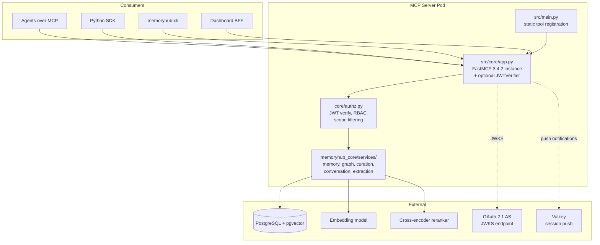

# Architecture

The MemoryHub MCP server is a FastMCP 3 application that exposes memory operations over streamable-HTTP (OpenShift) and STDIO (local dev). It is the sole entry point into the MemoryHub service layer -- the SDK, CLI, dashboard, and agents all connect through it.

## System overview



## Tool registration

Tools are **statically registered** in `src/main.py`. Each tool module is explicitly imported and added via `mcp.add_tool()`. The template's dynamic loader (`src/core/loaders.py`, `UnifiedMCPServer`) exists in the codebase but is not the active registration path -- it was designed for FastMCP 2 and does not register tools correctly in v3.

```
src/main.py
  ├── imports 14 tool modules from src/tools/
  ├── selects tools based on MEMORYHUB_TOOL_PROFILE
  └── calls mcp.add_tool() for each selected tool
```

### Tool profiles

The `MEMORYHUB_TOOL_PROFILE` environment variable controls which tools are exposed. This exists because action-dispatch tools (fewer tools, more complex parameters) work better with frontier models, while flat-parameter tools work better with smaller models.

| Profile | Tools | Use case |
|---------|-------|----------|
| **compact** (default) | 4 tools: `register_session` + `memory` (28 actions) + `thread` (9 actions) + `admin_memory` | Frontier models (Claude, GPT-4). Fewer tools, action-dispatch pattern |
| **full** | 13 tools: `register_session`, 10 flat-parameter tools (`search_memory`, `write_memory`, `read_memory`, etc.), `admin_memory`, `thread` | Smaller models that struggle with action-dispatch |
| **minimal** | 5 tools: `register_session` + `search_memory` + `write_memory` + `read_memory` + `thread` | Constrained contexts with limited tool slots |

The tool sets are defined in `_PROFILE_MAP` in `src/main.py` — that is the source of truth for counts. Action lists live in `_VALID_ACTIONS` in `src/tools/memory.py` and `src/tools/thread.py`. When these change, update this table, the profile counts in `docs/SYSTEMS.md`, and the headline count in the root `README.md`.

### All 14 tool modules

| Tool | Purpose |
|------|---------|
| `register_session` | Authenticate via API key, start session, init push subscriber |
| `memory` | Unified action-dispatch, 28 actions (search, read, write, update, delete, set_focus, relate, list, promote, graduate, checkpoint, reconstruct, project + entity + curation management, + more) |
| `thread` | Conversation persistence, 9 actions (create, append, get, list, archive, extract, fork, share, delete) |
| `admin_memory` | Content moderation (search cross-owner, quarantine, restore, hard delete) |
| `search_memory` | Vector similarity search with optional cross-encoder reranking |
| `read_memory` | Read/expand memory details with optional version history |
| `write_memory` | Create memories with scope, weight, content type |
| `update_memory` | Revise existing memories (preserves version history) |
| `delete_memory` | Soft-delete memories |
| `list_memory` | List memories by owner, scope, or project |
| `manage_session` | Session status, focus declaration, focus history |
| `manage_graph` | Create/query relationships between memories, find similar |
| `manage_curation` | Report/resolve contradictions, manage curation rules |
| `manage_project` | Project discovery, creation, membership management |

## Transport

| Mode | Env vars | Use case |
|------|----------|----------|
| **STDIO** | `MCP_TRANSPORT=stdio` | Local dev via `make run-local`. Hot-reload enabled via watchdog |
| **HTTP** | `MCP_TRANSPORT=http`, port 8080, path `/mcp/` | OpenShift deployment. Streamable-HTTP (not SSE) |

## Authentication

Two auth mechanisms, used in different contexts:

**JWT (production):** The `JWTVerifier` from FastMCP validates incoming tokens against the auth server's JWKS endpoint. Enabled when `AUTH_JWKS_URI` and `AUTH_ISSUER` are set. Tokens carry operational scopes (`memory:read`, `memory:write`, `memory:admin`) and access-tier scopes (`user`, `project`, `campaign`, etc.).

**API key (dev path):** Agents call `register_session(api_key="mh-dev-...")` at conversation start. This produces the same claim structure as a real JWT but lives in-pod memory. Intended to be retired once all consumers move to OAuth.

Both paths flow through `core/authz.py`, which builds SQL-level scope filters so RBAC violations are impossible by construction.

## Build and deploy

- **Base image:** `registry.redhat.io/ubi9/python-311:latest`
- **FastMCP version:** Pinned to 3.4.2 (3.4.3 returns 421 on all streamable-HTTP requests)
- **Container user:** UID 1001 (arbitrary non-root, OpenShift-compatible)
- **Permission fix:** Containerfile runs `chmod 644` on all Python files because Claude Code's Write tool creates files with 600 permissions
- **Namespace:** `memory-hub-mcp`

```bash
make install      # Create venv, install requirements
make run-local    # STDIO with hot-reload
make test         # pytest
make deploy       # Build and deploy to OpenShift
```

Dependencies are listed in `requirements.txt` (container builds use this, not pyproject.toml). The `memoryhub_core` library is built separately and staged into the container at build time.

## What's not active

These components exist in the codebase (inherited from the fips-agents template) but are not used by the running server:

- `src/core/server.py` (`UnifiedMCPServer`) -- template orchestrator, not invoked
- `src/core/loaders.py` (`load_all`) -- dynamic discovery, tools bypass this
- `src/prompts/` -- empty, no prompts registered
- `src/resources/` -- empty, no resources registered
- `src/middleware/` -- empty, no middleware deployed
- `.fips-agents-cli/generators/` -- Jinja2 scaffolding templates, useful for adding new tools but not part of runtime
